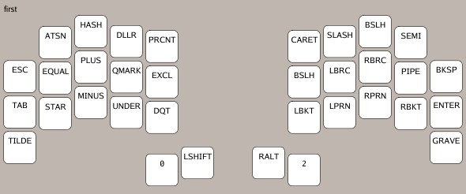
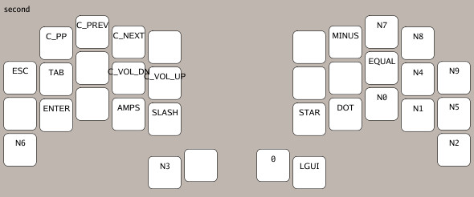

# Ferris Sweep Keymap
My keymap for the [Ferris Sweep](https://github.com/davidphilipbarr/Sweep)
running [ZMK](https://zmk.dev/), images are generated with
[ZMK viewer](https://github.com/MrMarble/zmk-viewer).

